# 环境配置问题

## YOLOv5-NPU

### 配置地址：

https://gitee.com/ascend/modelzoo-GPL/tree/master/built-in/PyTorch/Official/cv/object_detection/Yolov5_for_PyTorch_v6.0

https://www.hiascend.com/document/detail/zh/ModelZoo/pytorchframework/ptes/ptes_00001.html

### 配置环境：

#### ARM架构下的虚拟容器，用conda构建

## 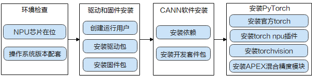

## 1.YOLOv5-NPU版本要求

### python    3.9

### gcc              >9.0

## 2.过早的文件结束符（EOF）


### 解决方法：文件太大，需要扩大 传输限制

```bash
git config --global http.postBuffer 524288000
git config --list
执行上述命令后看到如下结果
http.postbuffer=524288000
```

## 3.error：invalid command 'bdist_wheel'

### apt install wheel

## 4.E:Unable to locate package wheel

### 镜像内报错，解决方法更新apt update

## 5.invalid index-pack output


### 解决方法：文件太大，需要扩大 传输限制

```bash
git config --global http.postBuffer 524288000
git config --list
执行上述命令后看到如下结果
http.postbuffer=524288000
```

## 6.msnpureport command not found


### 原因：msnpureport工具不支持容器场景，部署容器时，禁止将msnpureport工具映射到容器内


### 解决方法：msnpureport具有导出日志功能，注释掉msnpureport有关的代码

## 7.awk报错：语法错误

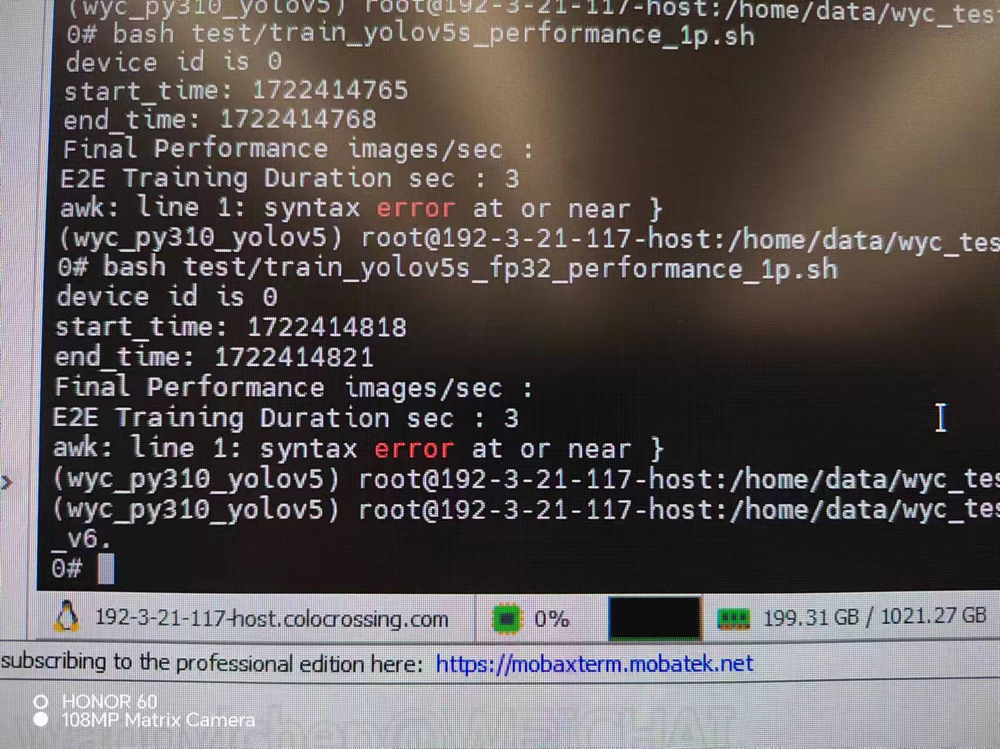

### 1.原因分析：查看文件train_yolov5s_performance_1p.sh,发现如下apt 图一段代码可能存在问题，查找train_${ASCEMD_DEVICE_ID}.log日志文件

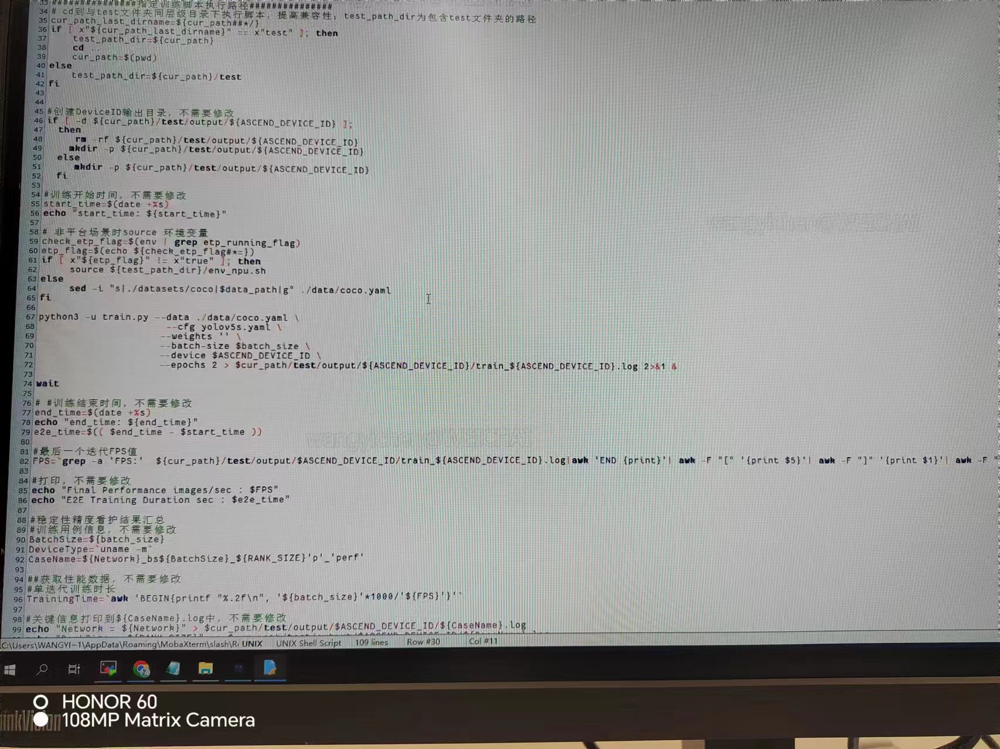

### 2.发现日志报错如下：no module named 'torch_npu'

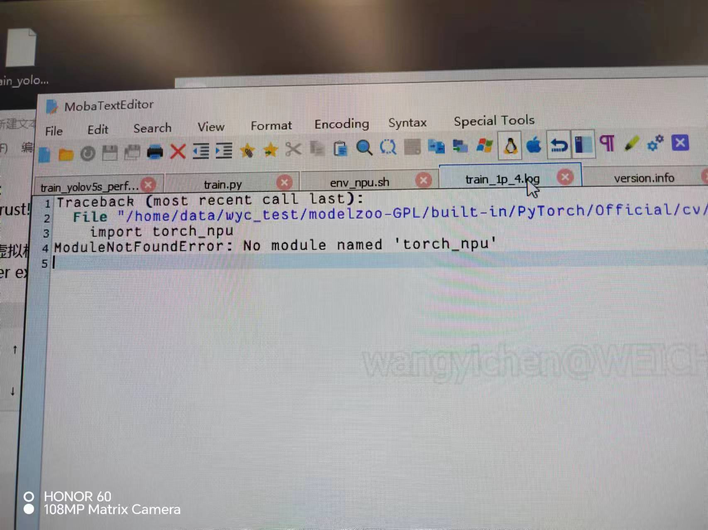

### 3.查找服务器CANN版本地址，/usr/local/Ascend/version.info,如下所示：

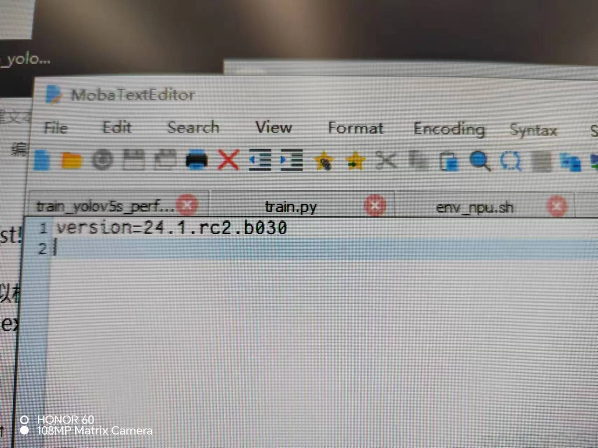

### 4.更新torch-npu版本

## 8.no module named 'apex'

### 安装apex，pip install apex报错：

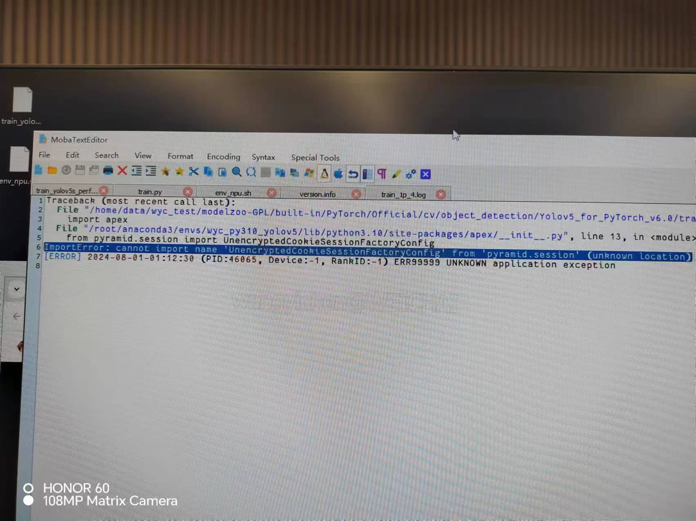

### 官网安装：https://www.hiascend.com/document/detail/zh/ModelZoo/pytorchframework/ptes/ptes_00001.html

## 9.报错RPC failed；curl 92 HTTP/2 stream 0 was not closed  cleanly:CANCEL(err 8)

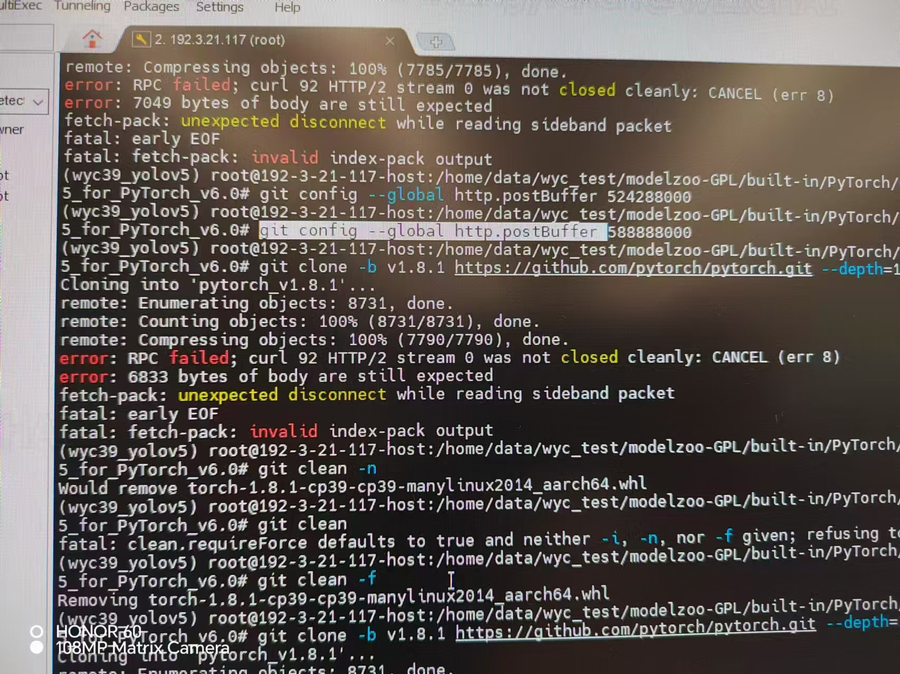

### 解决方法：清空缓存git clean -f，或者等待网络变好

## 10.报错：could not find。。。（QNNPACK）

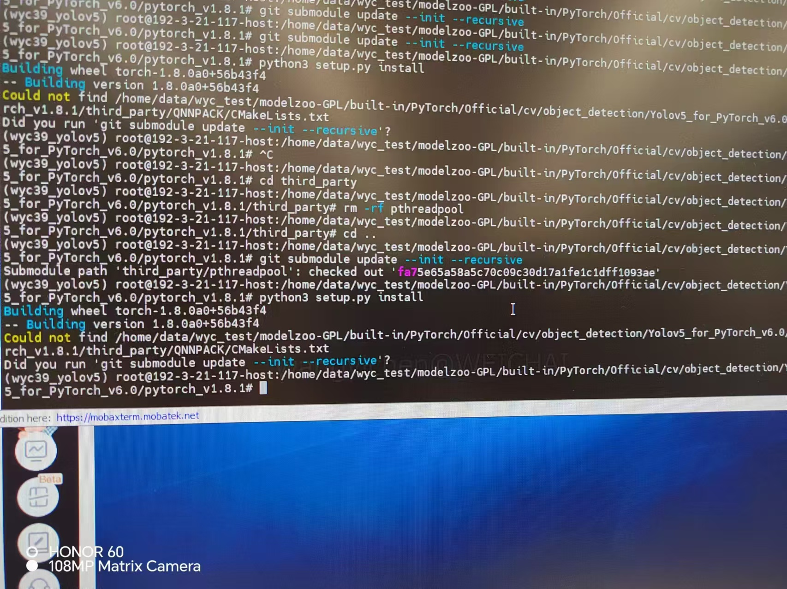

### 解决方法:删除QNNPACK，重新git submodule update --init --recursive

## 11.报错：failed to compile the wheel

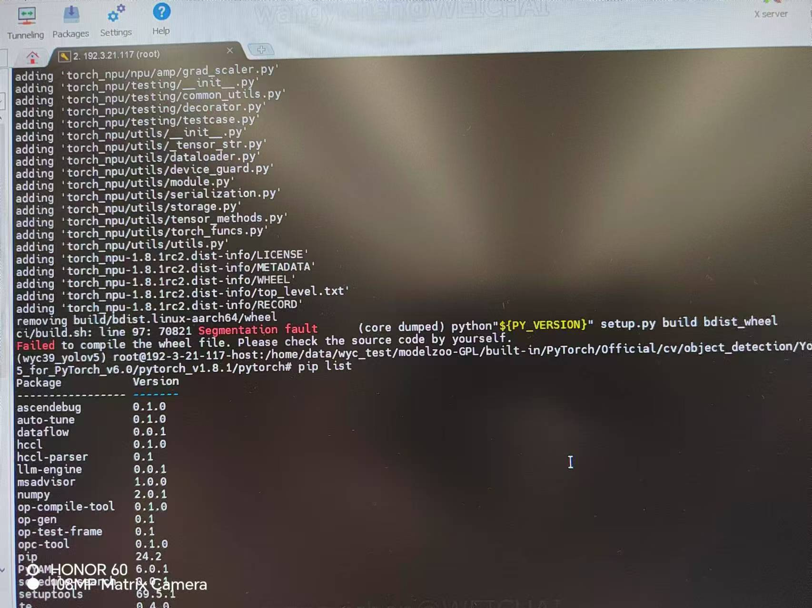

### 重新编译一遍错误消失

## 12.报错：libpython3.9.so：can not open shared object file:no such file or directory

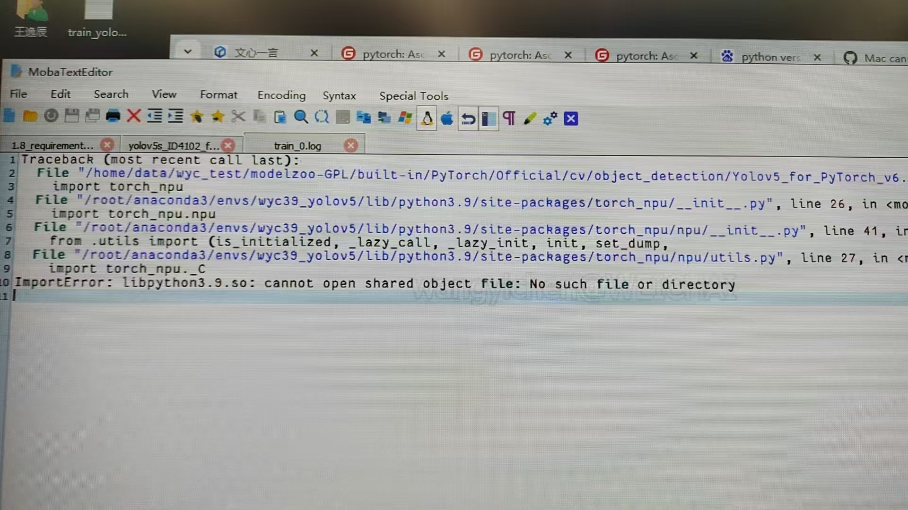

### 通过find查找，发现环境中存在该共享文件：

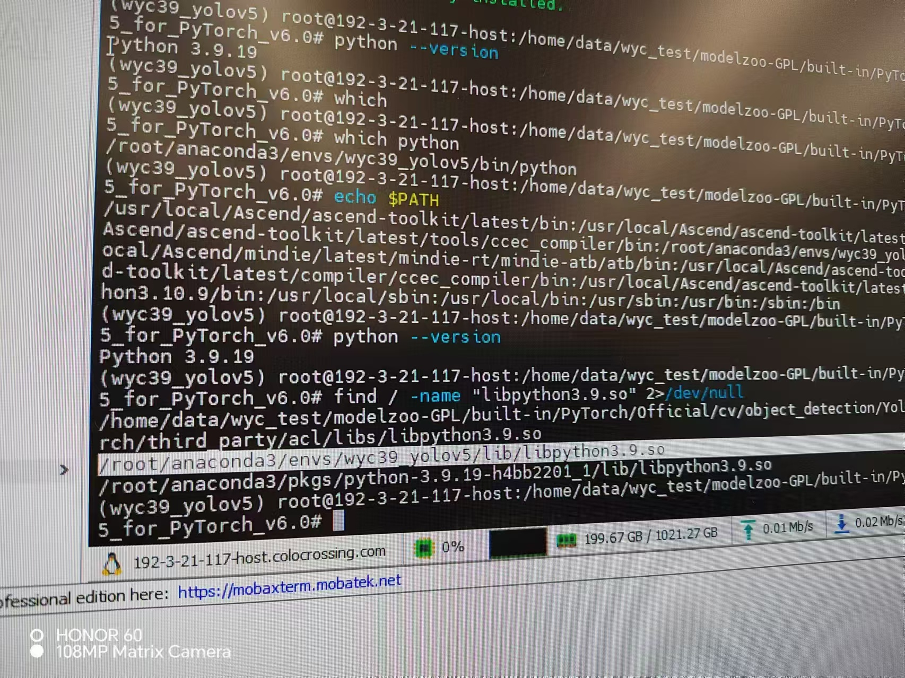

### 最后发现pytorch版本过老，重新安装

## 13.缺少一系列包如图所示

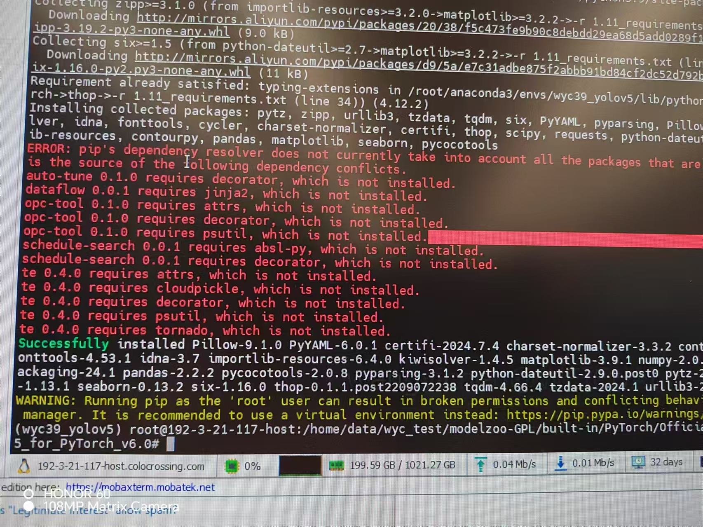

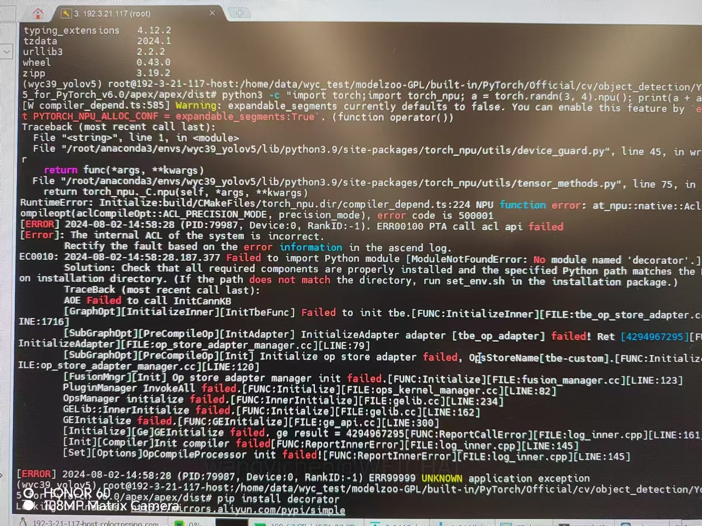

### 依次安装即可

## 14.valueError，but not set

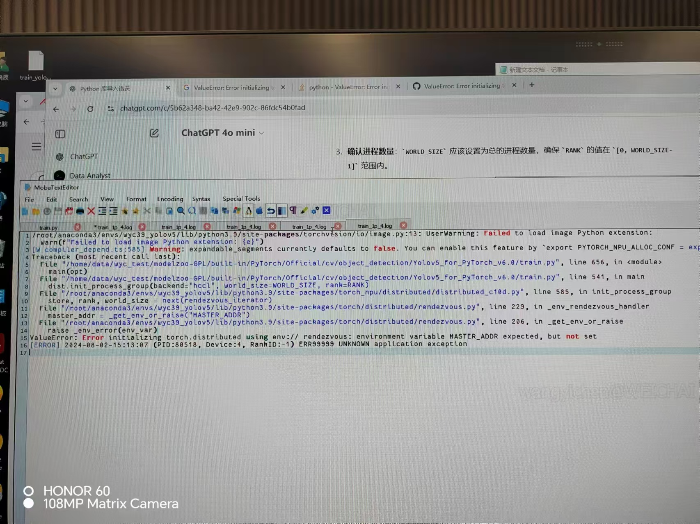

### 设置主机服务器和端口号

### 采用单机多卡训练

## 15.报错：unexpected bus error encountered in worker


### 将worker参数从32降为8以下，我降为0
